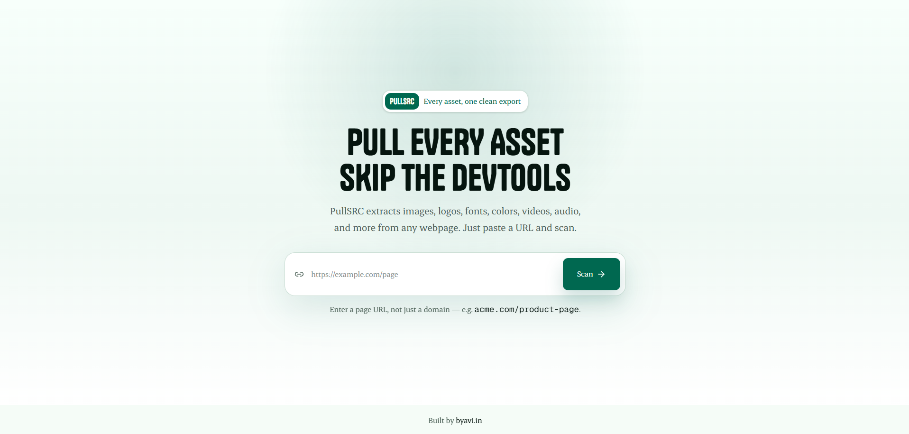

# PullSRC - Every asset, one paste



PullSRC is a web asset extraction tool for builders, designers, and developers who need to quickly collect the visible source materials from a single web page.

Paste a page URL, scan it, and PullSRC returns a clean asset kit containing images, logos, fonts, colors, video, audio, 3D models, and a credit sheet for attribution.

## Why PullSRC Exists

Modern web pages hide useful creative material across HTML, CSS, metadata, network requests, preload tags, and embedded media. PullSRC brings those scattered pieces into one organized workspace so you can inspect, download, and credit assets without manually digging through DevTools.

It is designed for:

- Designers collecting visual references from landing pages and product pages
- Developers rebuilding or auditing a page's asset usage
- Marketers and content teams saving page media with source context
- Students and researchers studying typography, color, and media systems

## What It Extracts

PullSRC scans one specific page at a time and groups results into clear categories:

- Images: page images, Open Graph images, and visual media references
- Logos: likely logo candidates detected from metadata, class names, IDs, and page structure
- Fonts: web fonts found in stylesheets and preload tags
- Colors: palette values parsed from page CSS
- Video: direct video files and detected streaming media references
- Audio: audio files linked or loaded by the page
- 3D models: model files and `model-viewer` sources
- Credits: source domain, page title, original URL, and scan date for each asset

## Product Flow

1. Paste a single page URL.
2. PullSRC validates and normalizes the URL.
3. The scanner fetches the page and inspects HTML, metadata, stylesheets, and media references.
4. A browser-backed media pass catches assets that appear through runtime network activity.
5. Results stream into the interface by category as they are found.
6. Download individual assets or export a ZIP with a generated credit sheet.

## Key Features

- Single-page scanning: avoids noisy whole-site crawls and keeps results focused
- Live streaming results: categories appear as soon as they are ready
- Organized dashboard: filter by images, fonts, logo, colors, video, sound, and 3D models
- Bulk export: download selected assets or everything as a ZIP
- Credit sheet: attribution context is included with every export
- Media-aware scanning: combines static extraction with browser network detection
- Safer URL handling: rejects private and unsafe hosts before scanning

## Responsible Use

PullSRC helps you find and download assets, but it does not grant ownership or usage rights.

Always review the original site's license, terms, and permissions before using downloaded material in a product, campaign, or public release. The included credit sheet is meant to preserve source context, not replace legal clearance.

## Tech Stack

- Next.js 16 App Router
- React 19
- TypeScript
- Tailwind CSS 4
- Base UI primitives
- Cheerio for HTML parsing
- Playwright for runtime media detection
- JSZip for export bundles
- `@google/model-viewer` for 3D previews

## Getting Started

Install dependencies:

```bash
npm install
```

Run the development server:

```bash
npm run dev
```

Open the app:

```text
http://localhost:3000
```

## Available Scripts

```bash
npm run dev
```

Starts the local development server.

```bash
npm run build
```

Creates a production build.

```bash
npm run start
```

Runs the production server after a build.

```bash
npm run lint
```

Runs ESLint across the project.

## Project Structure

```text
src/app
  api/download    Asset download proxy
  api/scan        Streaming scan endpoint
  scan            Scan results route
  page.tsx        Landing page

src/components/pullsrc
  landing-input.tsx       Hero input and landing content
  scan-page.tsx           Scan orchestration UI
  scanning-view.tsx       Loading state
  results-view.tsx        Asset dashboard
  asset-card.tsx          Asset preview and actions
  bulk-action-bar.tsx     Selected asset export controls
  credit-sheet-view.tsx   Attribution view

src/lib/pullsrc
  server/extract.ts        Static HTML/CSS/media extraction
  server/network-media.ts  Browser-backed media detection
  server/http.ts           Safe fetch and URL handling
  zip.ts                   ZIP export creation
  credit.ts                Credit sheet generation
  types.ts                 Shared scan and asset types
```

## Notes

- PullSRC scans a specific page URL, not an entire domain.
- Some pages may block automated scanning or require login access.
- Streaming video can sometimes be detected but not downloaded as a standalone file.
- Failed downloads are skipped during ZIP generation so the rest of the export can still complete.

## Status

PullSRC is currently an early product build. The core scanning, preview, filtering, downloading, and credit-sheet workflows are implemented, with room to keep improving extraction coverage and UI polish.
